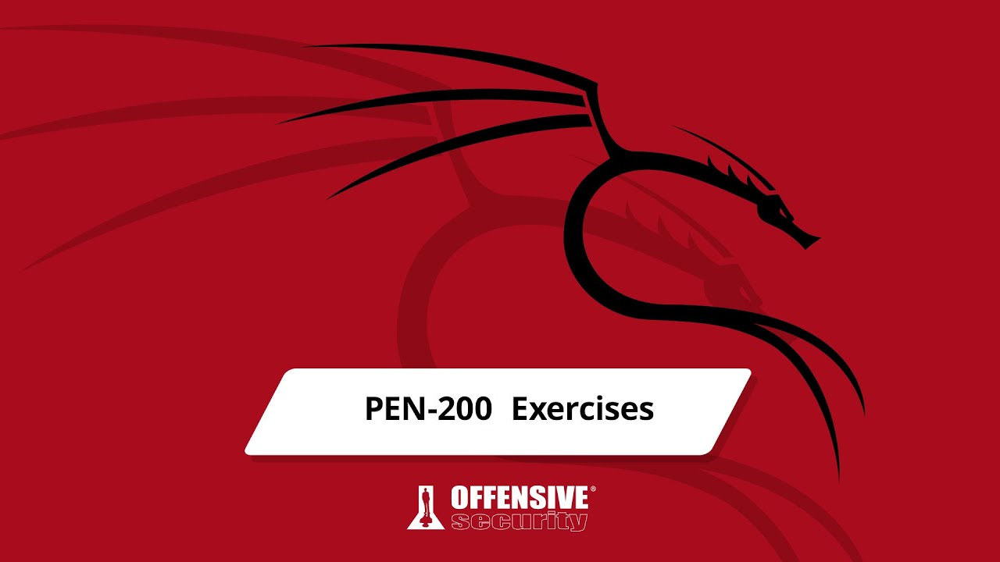

# PEN-200 OSCP Exercise Checklist

### Getting Comfortable with Kali

|PDF Number|Portal Number|Heading|No. of Exercises|Required|
|----------|-------------|-----|--------|--------|
 |2.3.6|2.3.6|Kali Documentation|3|No|
 |2.4.3.4|2.4.4|Finding Your Way Around Kali|5|Yes|
 |2.5.3|2.5.3|Managing Kali Linux Services|2|No|
 |2.6.6.1|2.6.7|Searching, Installing and Removing Tools|5|No|

### Command Line Fun
|PDF Number|Portal Number|Heading|No. of Exercises|Required|
|----------|-------------|-----|--------|--------|
 |3.1.3.1|3.1.4|The Bash Environment|2|Yes|
 |3.2.5.1|3.2.6|Piping and Redirection|2|Yes|
 |3.3.5.1|3.3.6|Text Searching and Manipulation|3|Yes|
 |3.5.3.1|3.5.4|Comparing Files|2|Yes|
 |3.6.3.1|3.6.4|Managing Processes|5|Yes|
 |3.7.2.1|3.7.3|File and Command Monitoring|2|Yes|
 |3.8.3.1|3.8.4|Downloading Files|1|Yes|
 |3.9.3.1|3.9.4|Customising the Bash Environment|2|Yes|

### Practical Tools
|PDF Number|Portal Number|Heading|No. of Exercises|Required|
|----------|-------------|-----|--------|--------|
 |4.1.4.3|4.1.5|Netcat|4|No|
 |4.2.4.1|4.2.5|Socat|4|Yes|
 |4.3.8.1|4.3.9|PowerShell and Powercat|3|Yes|
 |4.4.5.1|4.4.6|Wireshark|5|Yes|
 |4.5.3.1|4.5.3|Tcpdump|4|Yes|

### Bash Scripting
|PDF Number|Portal Number|Heading|No. of Exercises|Required|
|----------|-------------|-----|--------|--------|
 |5.7.3.1|5.7.4|Practical Examples|4|Yes|

### Passive Information Gathering
|PDF Number|Portal Number|Heading|No. of Exercises|Required|
|----------|-------------|-----|--------|--------|
 |6.3.1.1|6.3.1|Whois Enumeration|1|Yes|
 |6.4.1.1|6.4.1|Google Hacking|2|Yes|
 |6.5.1.1|6.5.1|Netcraft|2|Yes|
 |6.6.1.1|6.6.1|Recon-ng|2|No|
 |6.7.1.1|6.7.1|Open-Source Code|1|Yes|
 |6.12.1.1|6.12.3|User Information Gathering|2|Yes|
 |6.13.2.1|6.13.2|Social Media Tools|1|Yes|

### Active Information Gathering
|PDF Number|Portal Number|Heading|No. of Exercises|Required|
|----------|-------------|-----|--------|--------|
 |7.1.6.3|7.1.7|DNS Enumeration|3|Yes|
 |7.2.2.9|7.2.3|Port Scanning|5|Yes|
 |7.3.2.1|7.3.3|SMB Enumeration|3|Yes|
 |7.4.2.1|7.4.3|NFS Enumeration|2|Yes|
 |7.5.1.1|7.5.1|SMTP Enumeration|2|Yes|
 |7.6.3.6|7.6.4|SNMP Enumeration|2|Yes|

### Vulnerability Scanning
|PDF Number|Portal Number|Heading|No. of Exercises|Required|
|----------|-------------|-----|--------|--------|
 |8.2.4.2|8.2.5|Unauthenticated Scanning With Nessus|3|Yes|
 |8.2.5.2|8.2.7|Authenticated Scanning With Nessus|2|Yes|
 |8.2.6.1|8.2.9|Scanning With Individual Nessus Plugins|3|Yes|
 |8.3.1.1|8.3.1|Vulnerability Scanning With Nmap|1|Yes|

### Web Application Attacks
|PDF Number|Portal Number|Heading|No. of Exercises|Required|
|----------|-------------|-----|--------|--------|
 |9.3.4.1|9.3.4|Web Application Assessment Tools|1|Yes|
 |9.4.1.3|9.5.2|Exploiting Admin Consoles|2|Yes|
 |9.4.2.5|9.6.6|Cross-Site Scripting (XSS)|3|Yes|
 |9.4.3.2|9.7.2|Directory Traversal Vulnerabilities|1|Yes|
 |9.4.4.5|9.8.5|LFI Code Execution|2|Yes|
 |9.4.4.7|9.8.7|Remote File Inclusion|3|Yes|
 |9.4.4.10|9.8.10|PHP Wrappers|2|Yes|
 |9.4.5.4|9.9.4|Authentication Bypass|4|Yes|
 |9.4.5.9|9.9.9|Extracting Data From The Database|3|Yes|
 |9.4.5.11|9.9.11|From SQL Injection to Code Execution|2|Yes|
 |9.4.5.13|9.9.13|Automating SQL Injection|2|Yes|
 |9.5.1|9.10.1|Extra Miles|3|No|

### Introduction to Buffer Overflows
|PDF Number|Portal Number|Heading|No. of Exercises|Required|
|----------|-------------|-----|--------|--------|
 |10.2.5|10.2.5|Introduction to Buffer Overflows|2|Yes|

### Windows Buffer Overflows
|PDF Number|Portal Number|Heading|No. of Exercises|Required|
|----------|-------------|-----|--------|--------|
 |11.1.1.2|11.1.2|Discovering the Vulnerability|2|Yes|
 |11.2.3.1|11.2.4|Controlling EIP|3|Yes|
 |11.2.5.1|11.2.8|Checking for Bad Characters|2|Yes|
 |11.2.7.1|11.2.10|Finding a Return Address|2|Yes|
 |11.2.9.1|11.2.13|Getting a Shell|3|Yes|
 |11.2.10.1|11.2.15|Improving the Exploit|1|Yes|
 |11.2.10.2|11.2.16|Extra Miles|1|No|

### Linux Buffer Overflows
|PDF Number|Portal Number|Heading|No. of Exercises|Required|
|----------|-------------|-----|--------|--------|
 |12.2.1.2|12.2.1|Replicating the Crash|3|Yes|
 |12.3.1.1|12.3.1|Controlling EIP|2|Yes|
 |12.5.1.1|12.5.1|Checking for Bad Characters|2|Yes|
 |12.6.1.1|12.6.1|Finding a Return Address|2|Yes|
 |12.7.1.1|12.7.1|Getting a Shell|2|Yes|

### Client Side Attacks
|PDF Number|Portal Number|Heading|No. of Exercises|Required|
|----------|-------------|-----|--------|--------|
 |13.1.2.3|13.1.5|Know Your Target|3|No|
 |13.2.2.1|13.2.3|Leveraging HTML Applications|2|Yes|
 |13.3.2.1|13.3.3|Microsoft Word Macro|1|Yes|
 |13.3.3.1|13.3.5|Object-Linking and Embedding|1|Yes|
 |13.3.4.1|13.3.7|Evading Protected View|3|Yes|
### Locating Public Exploits
|PDF Number|Portal Number|Heading|No. of Exercises|Required|
|----------|-------------|-----|--------|--------|
 |14.3.1.1|14.3.1|Putting It All Together|5|Yes|

### Fixing Exploits
|PDF Number|Portal Number|Heading|No. of Exercises|Required|
|----------|-------------|-----|--------|--------|
 |15.1.3.1|15.1.4|Cross-Compiling Exploit Code|2|Yes|
 |15.1.4.1|15.1.6|Changing the Socket Information|2|Yes|
 |15.1.5.1|15.1.8|Changing the Return Address|1|Yes|
 |15.1.6.1|15.1.10|Changing the Payload|4|Yes|
 |15.1.7.1|15.1.12|Changing the Overflow Buffer|2|Yes|
 |15.2.3.1|15.2.4|Changing Connectivity Information|5|Yes|
 |15.2.4.1|15.2.6|Troubleshooting the "Index Out Of Range" Error|5|Yes|

### File Transfers
|PDF Number|Portal Number|Heading|No. of Exercises|Required|
|----------|-------------|-----|--------|--------|
 |16.1.3.2|16.1.4|Considerations and Preparations|3|No|
 |16.2.5.1|16.2.6|Transferring Files With Windows Hosts|4|No|

### Antivirus Evasion
|PDF Number|Portal Number|Heading|No. of Exercises|Required|
|----------|-------------|-----|--------|--------|
 |17.3.3.2|17.3.4|PowerShell In-Memory Injection|3|Yes|
 |17.3.3.4|17.3.5|Antivirus Evasion|4|Yes|

### Privilege Escalation
|PDF Number|Portal Number|Heading|No. of Exercises|Required|
|----------|-------------|-----|--------|--------|
 |18.1.1.13|18.1.2|Manual Enumeration|1|Yes|
 |18.1.2.1|18.1.4|Automated Enumeration|2|Yes|
 |18.2.3.2|18.2.4|User Account Control (UAC) Bypass: fodhelper.exe Case Study|1|Yes|
 |18.2.4.1|18.2.6|Insecure File Permissions: Seviio Case Study|2|Yes|
 |18.3.2.1|18.3.3|Insecure File Permissions: Cron Case Study|1|Yes|
 |18.3.3.1|18.3.5|Insecure File Permissions: /etc/passswd Case Study|1|Yes|

### Password Attacks
|PDF Number|Portal Number|Heading|No. of Exercises|Required|
|----------|-------------|-----|--------|--------|
 |19.1.1.1|19.1.2|Wordlists|1|No|
 |19.2.1.1|19.2.1|Brute Force Wordlists|1|No|
 |19.3.1.1|19.3.2|HTTP htaccess Attack with Medusa|2|No|
 |19.3.2.1|19.3.4|Remote Desktop Protocol Attack With Crowbar|1|No|
 |19.3.3.1|19.3.6|SSH Atttack With THC-Hydra|1|No|
 |19.3.4.1|19.3.8|HTTP Post Attack With THC-Hydra|2|No|
 |19.4.1.1|19.4.2|Retrieving Password Hashes|2|No|
 |19.4.2.1|19.4.4|Passing the Hash in Windows|2|No|
 |19.4.3.1|19.4.6|Password Cracking|1|No|

### Port Redirection and Tunnelling
|PDF Number|Portal Number|Heading|No. of Exercises|Required|
|----------|-------------|-----|--------|--------|
 |20.1.1.1|20.1.2|Port Forwarding|2|Yes|
 |20.2.1.1|20.2.2|SSH Local Port Forwarding|4|Yes|
 |20.2.2.2|20.2.4|SSH Remote Port Forwarding|3|Yes|
 |22.2.3.1|20.2.6|SSH Dynamic Port Forwarding|5|Yes|
 |20.3.1.1|20.3.1|PLINK.exe|3|Yes|
 |20.4.1.1|20.4.1|NETSH|2|Yes|
 |20.5.1.1|20.5.1|HTTPTunnel-ing Through Deep Packet Insection|3|Yes|

### Active Directory Attacks
|PDF Number|Portal Number|Heading|No. of Exercises|Required|
|----------|-------------|-----|--------|--------|
 |21.2.1.1|21.2.2|Traditional Approach|1|Yes|
 |21.2.2.1|21.2.4|A Modern Approach|3|Yes|
 |21.2.3.1|21.2.6|Resolving Nested Groups|2|Yes|
|21.2.4.1|21.2.8|Currently Logged On Users|3|Yes|
 |21.2.5.2|21.2.10|Enumeration Through Service Principal Names|4|Yes|
 |21.3.3.1|21.3.4|Cached Credential Storage and Retrieval|2|Yes|
 |21.3.4.1|21.3.6|Service Account Attacks|4|Yes|
 |21.3.5.1|21.3.8|Low and Slow Password Guessing|2|Yes|
 |21.4.2.1|21.4.3|Overpass the Hash|1|Yes|
 |21.4.3.1|21.4.5|Pass the Ticket|3|Yes|
 |21.4.4.1|21.4.7|Distributed Component Object Model|3|Yes|
 |21.5.1.1|21.5.2|Golden Tickets|2|Yes|

### Metasploit Framework
|PDF Number|Portal Number|Heading|No. of Exercises|Required|
|----------|-------------|-----|--------|--------|
 |22.1.3.1|22.1.4|Metasploit User Interfaces and Setup|3|Yes|
 |22.2.1.1|22.2.2|Exploit Modules|1|Yes|
 |22.3.3.2|22.3.4|Experimenting with Meterpeter|1|Yes|
 |22.3.7.1|22.3.9|Metasploit Payloads|7|Yes|
 |22.4.1.1|22.4.1|Building Our Own MSF Module|1|Yes|
 |22.5.4.1|22.5.5|Post-Exploitation with Metasploit|1|Yes|
 |22.6.1.1|22.6.1|Metasploit Automation|1|Yes|

### PowerShell Empire
|PDF Number|Portal Number|Heading|No. of Exercises|Required|
|----------|-------------|-----|--------|--------|
 |23.1.3.1|23.1.4|Installation, Setup and Usage|3|Yes|
 |23.3.1.1|23.3.1|PowerShell Modules|4|Yes|

### Assembling the Pieces
|PDF Number|Portal Number|Heading|No. of Exercises|Required|
|----------|-------------|-----|--------|--------|
 |24.2.2.2|24.2.2|SQL Injection Exploitation|1|Yes|
 |24.5.1.1|24.5.1|Exploitation|2|Yes|

